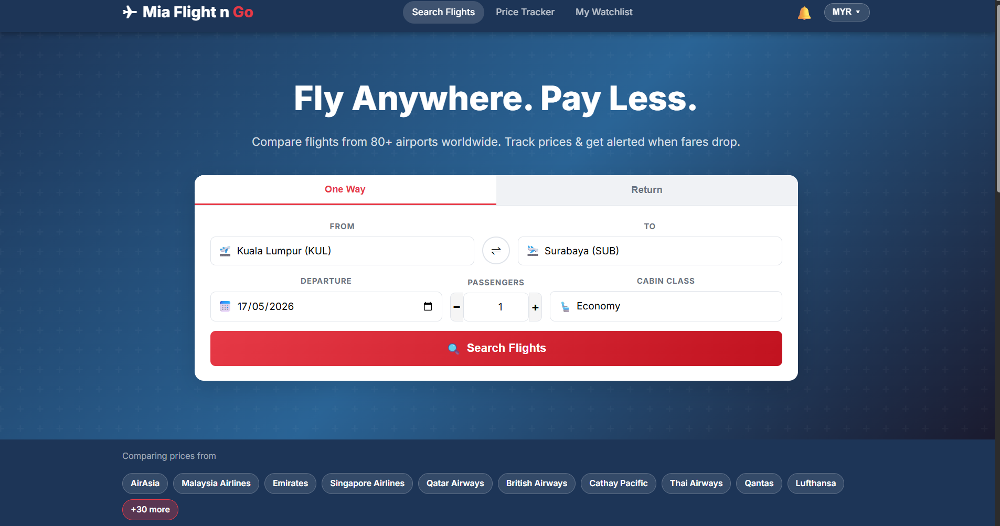
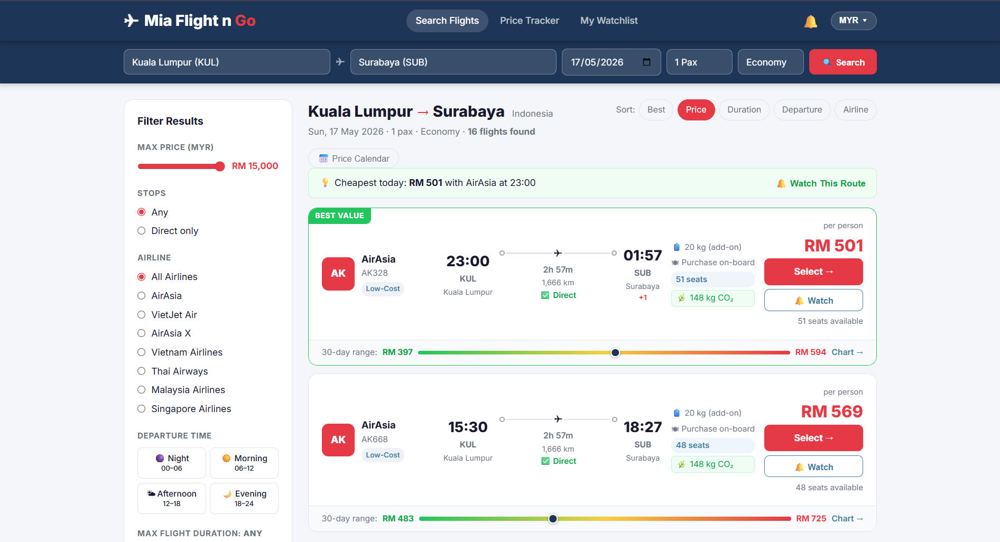
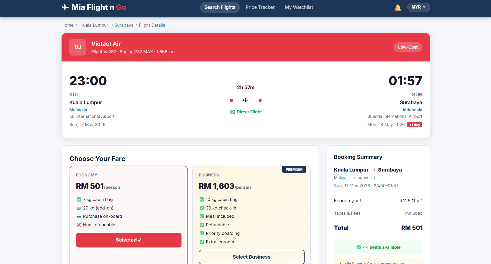
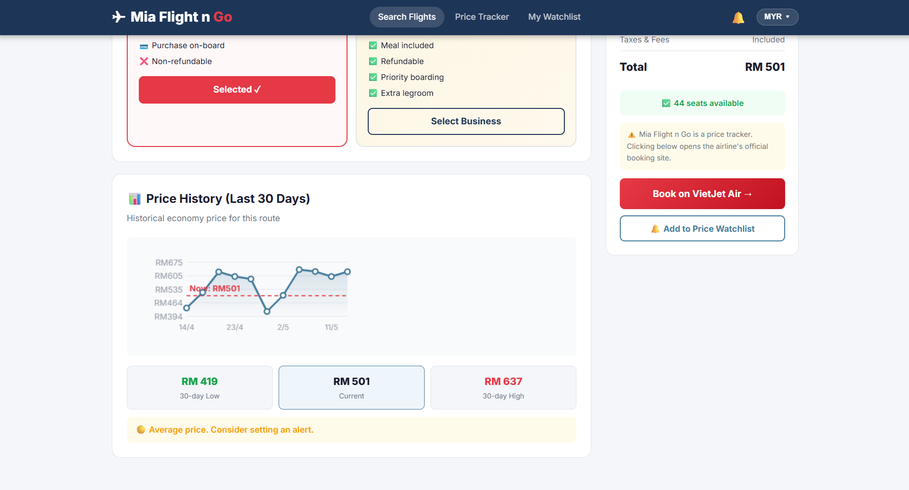

# ✈️ Mia Flight n Go

A global flight price tracker website built with PHP — search flights across 80+ airports worldwide, compare fares, track prices and get in-app alerts when prices drop.

## Screenshots

### 🏠 Homepage


### 🔍 Search Results


### 📋 Flight Details & Fare Comparison


### 📈 Price History Chart


## Features

- 🔍 Search flights between 80+ airports worldwide
- 💰 Compare Economy, Business and First Class fares
- 📅 Price Calendar — see cheapest dates at a glance
- 🔔 Price Watchlist — set a target price and get notified when it's hit
- 🌿 CO₂ emissions estimate per flight
- ⏱ Filter by departure time, max duration, stops and airline
- 💱 Currency switcher — MYR, USD, SGD, EUR, GBP, AUD, JPY, IDR
- 📈 30-day price history chart per flight
- 🏆 Best / Cheapest / Fastest sort options

## Tech Stack

| Technology | Role |
|---|---|
| PHP 8+ | Backend, flight data engine |
| Vanilla JS | Airport autocomplete, watchlist, filters, calendar |
| CSS3 | Responsive UI |
| localStorage | Watchlist & currency preference persistence |

## Running Locally

```bash
cd mia-flight-n-go
C:\php\php.exe -S localhost:8080
```

Then open `http://localhost:8080` in your browser.

## Airports Covered

Malaysia, Singapore, Indonesia (incl. Surabaya, Medan, Makassar, Yogyakarta), Thailand, Vietnam, Philippines, Japan, South Korea, China, India, UAE, UK, France, Germany, USA, Australia and more.

---

© 2026 Mia Flight n Go · Prices are indicative and for demonstration purposes only.
